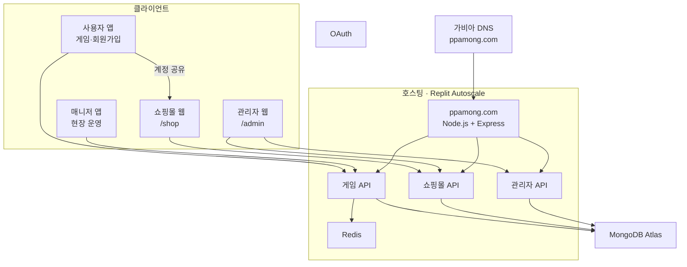

# ppamong 시스템 구조도

> 백엔드·API는 **Replit의 `web` 한 서버**. 클라이언트는 **사용자 앱 · 매니저 앱 · 쇼핑몰 웹 · 관리자 웹** 네 가지.

---

## 1. 전체 구조

---

## 2. 역할별 흐름

| 역할 | 사용 방식 | URL |
|------|-----------|-----|
| 일반 사용자 | Android / iOS 앱 | `/prediction`, `/login` … |
| 쇼핑 | 웹 (앱과 계정 동기) | `/shop`, `/shop/product/:id` |
| 운영자(매니저) | 별도 앱 | `/manager/*` |
| 관리자·슈퍼바이저 | 웹만 | `/admin/*` |

**정회원만 쇼핑몰 주문 가능** — 게스트·비로그인은 둘러보기·장바구니만.

---

## 3. 계층 요약

| 계층 | 무엇 |
|------|------|
| 사용자 앱 | 게임 + **회원가입 유일 입구** |
| 쇼핑몰 웹 | 굿웨어몰형 스포츠몰 (`/shop`) |
| 관리자 웹 | 게임 운영 + 쇼핑몰 상품·주문 관리 |
| 호스팅 | Replit Autoscale |
| DB | MongoDB Atlas + Redis |

---

## 관련 문서

- [PPAMONG_몰_정책.md](./PPAMONG_몰_정책.md)
- [PPAMONG_프로젝트_구조.md](./PPAMONG_프로젝트_구조.md)
