# DB 구조 및 ERD

> **DB**: PostgreSQL (Neon Database serverless)  
> **ORM**: Drizzle ORM  
> **Schema 파일**: `shared/schema.ts`

---

## ERD (Mermaid)

```mermaid
erDiagram
    users {
        varchar id PK "uuid, gen_random_uuid()"
        text username UK "NOT NULL"
        text name "NOT NULL"
        text password "nullable (소셜 로그인 시 null)"
        text phone UK "nullable"
        text email "nullable"
        text provider "local|kakao|google|apple|guest, default:local"
        text provider_id "nullable, unique(provider+provider_id)"
        text invite_code UK "자동 생성 6자리"
        text referral_code "추천인 초대코드"
        text verification_code "nullable"
        timestamp verification_code_expiry "nullable"
        integer points "default:0"
        timestamp last_attendance_date "nullable"
        integer is_suspended "default:0 (1=정지)"
        timestamp suspended_at "nullable, 소프트삭제 시각"
        integer is_online "default:0"
        timestamp last_login_at "nullable"
        timestamp last_logout_at "nullable"
        timestamp last_active_at "nullable"
        integer total_donation_amount "default:0"
        timestamp created_at "NOT NULL, now()"
    }

    stadiums {
        serial id PK
        text name UK "NOT NULL"
        timestamp created_at "NOT NULL"
    }

    matches {
        varchar id PK "uuid"
        text name "NOT NULL"
        integer stadium_id FK "→ stadiums.id"
        date match_date "YYYY-MM-DD"
        timestamp start_time "NOT NULL"
        timestamp end_time "NOT NULL"
        text match_status "scheduled|ongoing|completed|cancelled, default:scheduled"
        integer current_round "default:1"
        boolean prediction_enabled "default:false"
    }

    predictions {
        serial id PK
        varchar user_id FK "→ users.id"
        varchar match_id FK "→ matches.id"
        integer round_number "default:1"
        text prediction "1루|2루|3루|홈런|아웃"
        integer amount "default:100 (베팅 포인트)"
        text status "pending|success|fail, default:pending"
        text result "nullable, 실제 경기 결과"
        integer won_amount "default:0, 승리 시 지급 포인트"
        integer donated_amount "default:0, 기부한 포인트"
        timestamp created_at "NOT NULL"
    }

    round_statistics {
        serial id PK
        varchar match_id FK "→ matches.id"
        integer round_number "NOT NULL"
        integer total_participants "default:0"
        integer total_points "default:0"
        integer total_winners "default:0"
        timestamp prediction_start_time "nullable"
        timestamp prediction_stop_time "nullable"
        boolean is_prediction_started "default:false"
        boolean is_prediction_stopped "default:false"
        boolean is_result_sent "default:false"
        timestamp created_at "NOT NULL"
    }

    attendance_records {
        serial id PK
        varchar user_id FK "→ users.id"
        timestamp attendance_date "NOT NULL"
    }

    posts {
        serial id PK
        text title "NOT NULL"
        text content "NOT NULL"
        varchar author_id FK "→ users.id"
        integer view_count "default:0"
        timestamp created_at "NOT NULL"
    }

    comments {
        serial id PK
        integer post_id FK "→ posts.id (cascade delete)"
        text content "NOT NULL"
        varchar author_id FK "→ users.id"
        timestamp created_at "NOT NULL"
    }

    point_transactions {
        serial id PK
        varchar user_id FK "→ users.id"
        text transaction_type "earned|spent|donation|donated_spent"
        integer amount "양수=획득, 음수=사용"
        integer balance "거래 후 잔액"
        text description "거래 설명"
        timestamp created_at "NOT NULL"
    }

    inquiries {
        serial id PK
        varchar user_id FK "→ users.id"
        text category "계정 문제|게임 문제|기술적 문제|기타"
        text title "NOT NULL"
        text content "NOT NULL"
        text status "pending|in_progress|resolved, default:pending"
        text response "nullable, 관리자 답변"
        timestamp created_at "NOT NULL"
    }

    notices {
        serial id PK
        text tag "공지|업데이트|이벤트"
        text title "NOT NULL"
        text content "NOT NULL"
        integer display_order "default:0"
        timestamp created_at "NOT NULL"
        timestamp updated_at "NOT NULL"
    }

    terms {
        serial id PK
        text title "NOT NULL"
        text content "NOT NULL"
        text type "service|privacy"
        timestamp created_at "NOT NULL"
        timestamp updated_at "NOT NULL"
    }

    faqs {
        serial id PK
        text question "NOT NULL"
        text answer "NOT NULL"
        integer order "default:0"
        timestamp created_at "NOT NULL"
    }

    ebooks {
        serial id PK
        text name "NOT NULL"
        integer price "NOT NULL"
        timestamp created_at "NOT NULL"
    }

    ebook_purchases {
        serial id PK
        varchar user_id FK "→ users.id"
        integer ebook_id FK "→ ebooks.id"
        timestamp purchased_at "NOT NULL"
    }

    admin_users {
        varchar id PK "uuid"
        text email UK "NOT NULL"
        text username UK "NOT NULL"
        text name "NOT NULL"
        text password "NOT NULL, bcrypt"
        text department "nullable"
        text position "nullable"
        text phone "NOT NULL"
        text user_type "일반어드민|슈퍼어드민|매니저, default:일반어드민"
        text approval_status "대기중|승인|거부, default:대기중"
        text status "활성화|비활성화, default:활성화"
        text assigned_match_number "nullable, 1경기|2경기|..."
        boolean logout_allowed "default:false"
        timestamp last_login "nullable"
        timestamp last_logout "nullable"
        timestamp created_at "NOT NULL"
    }

    advertisements {
        serial id PK
        text video_name "NOT NULL"
        text video_url "NOT NULL (Object Storage URL)"
        integer earned_points "default:4"
        timestamp created_at "NOT NULL"
    }

    ad_view_history {
        serial id PK
        varchar user_id FK "→ users.id"
        integer advertisement_id FK "→ advertisements.id"
        timestamp viewed_at "NOT NULL"
    }

    waiting_screens {
        serial id PK
        text video_name "NOT NULL"
        text video_url "NOT NULL (Object Storage URL)"
        integer display_duration "default:4 (초)"
        timestamp created_at "NOT NULL"
    }

    users ||--o{ attendance_records : "출석 기록"
    users ||--o{ posts : "작성"
    users ||--o{ comments : "작성"
    users ||--o{ point_transactions : "포인트 내역"
    users ||--o{ inquiries : "문의"
    users ||--o{ predictions : "예측"
    users ||--o{ ebook_purchases : "구매"
    users ||--o{ ad_view_history : "광고 시청"
    posts ||--o{ comments : "댓글 (cascade)"
    ebooks ||--o{ ebook_purchases : "구매됨"
    stadiums ||--o{ matches : "경기장"
    matches ||--o{ predictions : "예측"
    matches ||--o{ round_statistics : "라운드 통계"
    advertisements ||--o{ ad_view_history : "시청 기록"
```

---

## 테이블 설명

### users
일반 유저 계정. `provider`로 로그인 방식 구분.  
- `is_suspended = 1` + `suspended_at` 설정 = 소프트 삭제 (7일 후 배치로 영구 삭제)  
- `invite_code`: 6자리 고유 초대 코드 (회원가입 시 자동 생성)  
- `referral_code`: 가입 시 입력한 추천인 코드  
- `(provider, provider_id)` 복합 UNIQUE 제약

---

### admin_users
관리자 및 매니저 계정 (같은 테이블, `user_type`으로 구분).  
- `일반어드민`: 일반 관리자 기능  
- `슈퍼어드민`: 최상위 권한  
- `매니저`: 경기 현장 운영 (앱: com.ppadun9.manager)  
- `assigned_match_number`: 담당 경기 번호 (`1경기`, `2경기` 등)  
- 중복 로그인 시 **first-login-priority 차단** (409 반환)

---

### matches
경기 정보.  
- `match_status`: `scheduled` → `ongoing` → `completed` / `cancelled`  
- `prediction_enabled`: 매니저가 예측 시작/중지 시 변경  
- `current_round`: 라운드가 넘어갈 때마다 증가  
- 자동 완료 배치: `matchDate < KST 오늘` 또는 `endTime` 초과 시 자동 `completed`

---

### predictions
유저의 라운드별 예측.  
- `(user_id, match_id, round_number)` 복합 UNIQUE → 라운드당 1회만 예측 가능  
- `amount`: 베팅 포인트 (현재 고정 100)  
- `won_amount`: 승리 시 분배받은 포인트 (패자 풀 ÷ 승자 수)  
  - `won_amount - amount = prize` (순이익)  
  - `prize = 0`이면 기부 불가 (모든 유저가 같은 팀 예측 시)  
- `donated_amount`: 기부한 포인트 (prize의 10%)

---

### round_statistics
라운드별 집계 정보. 중복 결과 전송 방지용 `is_result_sent` 플래그.

---

### point_transactions
모든 포인트 이동 기록.  
- `transaction_type`:
  - `earned`: 포인트 획득 (출석, 예측 승리, 광고 시청)
  - `spent`: 포인트 사용 (예측 베팅)
  - `donation`: 기부 수령 (기부받은 포인트)
  - `donated_spent`: 기부 지출 (기부한 포인트 차감)

---

### advertisements / waiting_screens
영상 파일은 Replit Object Storage에 저장, URL만 DB에 기록.

---

## 주요 제약 조건 요약

| 테이블 | 제약 | 내용 |
|--------|------|------|
| users | UNIQUE | username |
| users | UNIQUE | phone |
| users | UNIQUE | invite_code |
| users | UNIQUE | (provider, provider_id) |
| admin_users | UNIQUE | email |
| admin_users | UNIQUE | username |
| predictions | UNIQUE | (user_id, match_id, round_number) |
| comments | CASCADE DELETE | post 삭제 시 댓글 자동 삭제 |

---

## Redis 사용 (세션 / 인증)

DB 외에 Redis에 저장되는 데이터:

| Key 패턴 | TTL | 내용 |
|----------|-----|------|
| `session:user:<userId>` | 세션 유지 | 유저 로그인 세션 |
| `session:manager:<adminId>` | 세션 유지 | 매니저 로그인 세션 |
| `session:admin:<adminId>` | 세션 유지 | 관리자 로그인 세션 |
| `phone_verify:<phone>` | 180초 | SMS 인증번호 |
| `phone_verified:<phone>` | 1800초 | 인증 완료 상태 |
| `authcode:<code>` | 300초 | 소셜 로그인 일회성 코드 |
