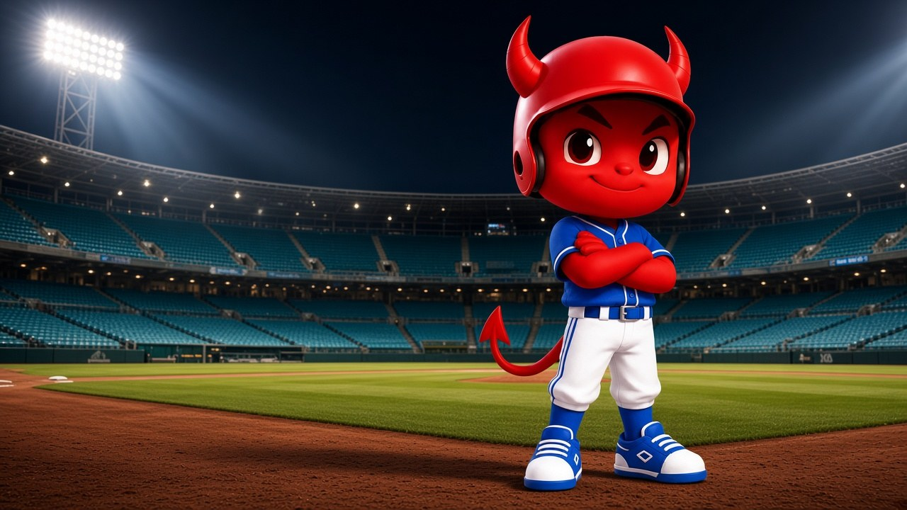

# 빠몽이 사용자 설명서 (사용 + 기술)

기준일: 2026-08-27  
대상: `/login` · `/home` · `/prediction`

이 문서는 관리자 화면 `/admin/ops/system-manuals` 3장과 같은 소스입니다.

## 사용 설명서 — 단계

홈 「예측게임 하러가기」 → 실황 ON 경기 선택 → 사이드벳(선택) → 타석 7단계.

### 1. 경기전

경기 시작 카운트다운. 베이스 버튼 없음.

### 2. 대기 (초=청 / 말=흰)

「다음 타자 예측을 기다리고 있습니다」. 예측이 열리기 전.

### 3. 예측 선택

아웃·1루·2루·3루·홈런 버튼과 포인트. 선택 좌표는 이 구장만 사용.

### 4–5. 결과 대기 · 글씨

4: 「내 예측」 배지. 베이스 버튼은 없음.  
5: 약 2.2초 큰 글씨. 적중이면 주루, 빗나가면 대기로 복귀.

### 6. 주루 (적중만)

배트 토스 후 주루. 1루=홈→1루, 2루=홈→1→2, 3루=홈→1→2→3, 홈런=1·2·3루를 돌아 홈. 중견으로는 가지 않음.

### 7. 다음 타석

축하 점프는 생략. 바로 대기이거나, 이미 열려 있으면 선택 화면.

## 단계 표

| # | 단계 | 배경 | 하는 일 |
| --- | --- | --- | --- |
| 1 | 경기전 (시작 대기) | 쿠어스 필드 주간 전경 | 경기 시작 카운트다운. 베이스 버튼 없음. |
| 2 | 대기 (다음 타자 대기) | 시네마틱 빠몽이 (초=청 유니폼 / 말=흰 유니폼) | 「다음 타자 예측을 기다리고 있습니다」. 예측이 열리기 전. |
| 3 | 예측 선택 (타석 예측) | 3D 빈 구장 | 아웃·1루·2루·3루·홈런 버튼과 포인트. 선택 좌표는 이 구장만 사용. |
| 4 | 결과 대기 (결과 기다림) | 시네마틱 투수 (초/말) | 「내 예측」 배지. 베이스 버튼은 없음. |
| 5 | 결과 글씨 (결과 확정) | 결과 대기와 같음 | 약 2.2초 큰 글씨. 적중이면 주루, 빗나가면 대기로 복귀. |
| 6 | 주루 (예측 성공) | 필리스 실사 다이아몬드 | 배트 토스 후 주루. 1루=홈→1루, 2루=홈→1→2, 3루=홈→1→2→3, 홈런=1·2·3루를 돌아 홈. 중견으로는 가지 않음. |
| 7 | 다음 타석 (반복) | 대기 또는 예측 선택 | 축하 점프는 생략. 바로 대기이거나, 이미 열려 있으면 선택 화면. |

- 실패·투수교체·공수교대는 3D 구장을 유지합니다. 주루 실사는 적중 연출에만 씁니다.
- 좌상단은 경기 진행 위젯(이닝·점수=다음, 주자·B-S·OUT=네이버)입니다. 공지는 설정에서만 봅니다.
- 예측 게임 중 하단 배너 광고는 없습니다. 공수교대·투수교체 때 리워드 동영상만 나옵니다.
- 타석 예측은 경기 시작 5분 전부터 가능합니다. 예측 창은 열린 뒤 약 8초 후 자동 중지될 수 있습니다.

## 규칙·배당

- 타석 금액: 50 / 100 / 200 / 500 / 1000P. 배당 아웃 1.2 / 1루 1.5 / 2루 3 / 3루 10 / 홈런 5.
- 사이드벳: 100 / 200 / 300 / 500 / 700 / 1000P. 우승팀 2배, 최종 스코어 20배. 1회 시작 전 마감, 경기 종료 후 실황 스코어로 정산.
- 광고: 공수·투수 때만 리워드. 웹 5초 후 ×(보상 없음). 운영자 중지 시 500P. 게임 하단 배너 없음.
- 스마트폰은 화면을 한 번 탭해야 음성이 납니다. 자리비움 중 해당 타석 예측은 불가합니다.
- 끝난 경기 마지막 화면이 남으면 제목을 눌러 오늘 실황 ON인 다른 경기를 고릅니다.

### 타석 배당

| 예측 | 배당 | 100P 적중 |
| --- | --- | --- |
| 아웃 | 1.2배 | 120P |
| 1루 | 1.5배 | 150P |
| 2루 | 3배 | 300P |
| 3루 | 10배 | 1000P |
| 홈런 | 5배 | 500P |

### 광고

| 상황 | 동작 | 보상 |
| --- | --- | --- |
| 투수교체·공수교대 | 안내 5초 후 리워드 동영상 시작 | 운영자 중지까지 보면 500P |
| 예측 시작 | 광고 중지 (ad_stopped: prediction_start) | 없음 |
| 운영자 광고 중지 | ad_stopped: operator_stop | 500P |
| 라운드 진행만 | ad_stopped: round_advance — 광고만 닫기 | 없음 |
| 웹 × (5초 후) | 같은 광고 세션은 재표시 안 함 | 없음 |
| 80초 경과 | 워치독이 광고 세션을 종료(reason=operator_stop). 예측 창은 운영자 「예측 시작」 | 500P |
| 예측 게임 하단 배너 | 사용하지 않음 | — |

## 기술 설명서

| 항목 | 내용 |
| --- | --- |
| 진입 | /login 인트로 24컷 → /home → /prediction |
| 인증 | JWT access+refresh. 게임 중 4분 keepAlive, 만료 2분 전 refresh. WS 4005는 forceRefresh 후 재연결 |
| 경기 선택 | localStorage ppamong.prediction.selectedMatch. 종료·취소면 삭제하고 모달 |
| 화면 단계 | wait_start / picking / wait_result / result_flash / success_running / ad_playing / match_ended |
| 배경 | before / wait_home\|away / field(3D) / pitch_home\|away / running. 대기는 시네마틱만 |
| WS | /ws/match. uiStage가 권위. prediction_started는 음성·광고 부수효과 |
| 폴링 | 목록·스코어·phase 8~10초 보조. 429·세션 오류 시 캐시를 null로 덮지 않음 |
| 복귀 | visibilitychange·pageshow·appStateChange로 WS 재연결, /check로 타석 맞춤 |
