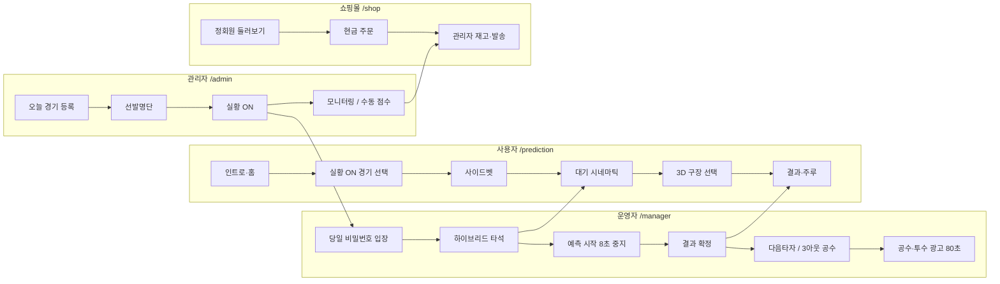

# 빠몽이 전체 흐름도 (관리자 · 운영자 · 사용자 · 쇼핑몰)

기준일: 2026-08-27  
대상: PPAMONG (ppamong.com) Express + MongoDB `ppamong` + Redis + WebSocket `/ws/match`

이 문서는 관리자 화면 `/admin/ops/system-manuals` 1장과 같은 소스입니다.

## 한눈에

## 역할별 단계

### 관리자 /admin

1. 오늘 경기 등록·저장 (다음 스포츠 일정)
2. 오늘의 선발명단 (다음으로 경기, 네이버 타순)
3. 운영자 리스트에서 실황 ON (기본 1경기)
4. 실시간 모니터링 · 필요 시 점수 수동
5. 종료 후 사이드벳 정산·문의·공지

### 운영자 /manager

1. 당일 비밀번호로 배정 경기 입장
2. 하이브리드: 실황 힌트 + 버튼 우선
3. 예측 시작 → (8초 자동 중지) → 결과 확정
4. 다음 타자 / 3아웃이면 공수교대
5. 투수교체·공수 = 광고 80초. 예측 시작으로 광고 끔
6. 경기종료 10초 후 로그아웃

### 사용자 /login · /prediction

1. 인트로 24컷 → 홈 → 예측게임 하러가기
2. 제1~5 중 실황 ON 경기 선택 · 사이드벳
3. 대기(시네마틱) → 선택(3D) → 결과대기 → 글씨
4. 적중 시 주루 실사, 실패는 3D 유지
5. 공수·투수 때 리워드 광고. 배너 없음
6. 종료 10초 후 홈. 끝난 경기는 다시 고름

### 쇼핑몰 /shop

1. 정회원만 주문 (게스트는 둘러보기)
2. 장바구니 → 현금 주문 접수
3. 게임 포인트로 직접 결제하지 않음
4. 관리자가 주문·재고·발주 처리
5. 운영자 앱에는 몰 관리 없음

## 교차 규칙

- 실황: 점수·이닝·로고 = 다음 스포츠 / 주자·B-S·OUT·타자·구종 = 네이버. API-SPORTS 키 없음.
- 연결: Express :5000 + MongoDB `ppamong` + Redis 세션 + WebSocket `/ws/match`.
- 실황 ON(AdminUser.apiSyncEnabled)인 경기만 회원이 「경기 선택」에서 고를 수 있습니다.
- 「예측 시작」은 predictionEnabled만 켭니다. matchStatus=ongoing은 다음 실황이 시작했을 때만.

## 관리자 일일 체크

1. 경기 관리에서 오늘 KBO 일정을 등록·저장합니다. 팀 로고는 다음 스포츠 imageUrl입니다.
2. 「오늘의 선발명단」으로 타순을 맞춥니다(다음으로 경기 찾기, 네이버로 타순).
3. 운영자 리스트에서 해당 경기 「실황 ON」(다음+네이버+회원 게임 연동). 기본은 1경기만 ON입니다.
4. 실시간 게임 모니터링에서 배팅 분포·사이드벳·스코어를 확인합니다.
5. 점수 이상이 있으면 수동 보정 후, 끝나면 수동을 끄고 실황에 맡깁니다.
6. 경기 종료 후 사이드벳 정산·문의·공지를 확인합니다.

## 관리자 메뉴

### 기본

- 앱 홈 설정
- KBO 선수단
- 오늘의 선발명단
- 앱 파일 등록/다운로드

### 쇼핑몰 · 판매

- 쇼핑몰 확인·관리
- 주문·판매·재고·구매 관리

### 슈퍼바이저

- 관리자 등록·리스트
- 시스템 매뉴얼
- 디비 백업하기
- 관리자·운영자 로그인 현황

### 수익

- 동영상 광고 수익·관리
- 배너 수익
- 대기 화면 관리

### 경기 · 회원

- 경기 관리(달력)
- 실시간 게임 모니터링
- 운영자 등록·리스트·상태
- 회원 리스트·랭킹·초대

### 고객 지원

- 공지
- 회원 문의
- 게시판
- 약관

## 쇼핑몰

- 운영 URL: https://ppamong.com/shop (회원가입은 사용자 앱만).
- 정회원(게스트 아님)만 주문. 게스트·비로그인은 둘러보기·장바구니만.
- 1차 결제는 현금 주문 접수. 게임 포인트로 직접 결제하지 않습니다.
- 관리자 웹에서 상품·주문·재고·매입을 다룹니다. 운영자 앱에서는 몰 관리가 없습니다.

## 타이밍

| 항목 | 기본값 |
| --- | --- |
| 타석 참여 | 경기 시작 5분 전부터 종료 전까지 |
| 실황 폴링 | 기본 2초 (최소 1.5초) |
| 타자명 안정화 | 약 2초 (깜빡임 방지) |
| 투수명 안정화 | 기본 6초 (최소 3초) |
| 예측 창 자동 중지 | 열린 뒤 약 8초 |
| 결과 큰 글씨 | 약 2.2초 (자리비움 복귀는 더 짧음) |
| 광고 인트로 | 공수·투수교체 안내 5초 후 광고 |
| 리워드 광고 | 80초 재생. 5초 후 ×(보상 없음). 운영자 중지 시 500P |
| 경기종료 연출 | 약 10초 후 회원은 홈, 운영자는 로그아웃 |

배팅: 타석 50 / 100 / 200 / 500 / 1000P · 사이드벳 100 / 200 / 300 / 500 / 700 / 1000P · 승리팀 2배 · 최종스코어 20배
