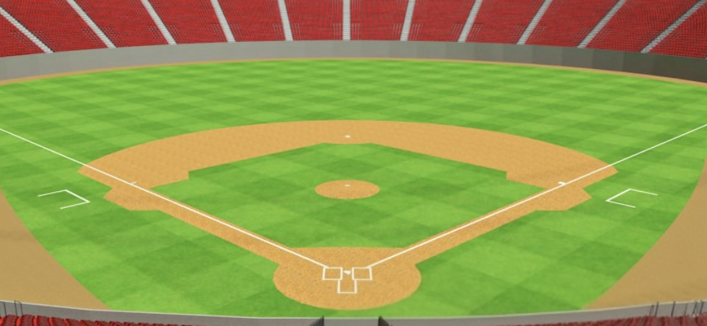
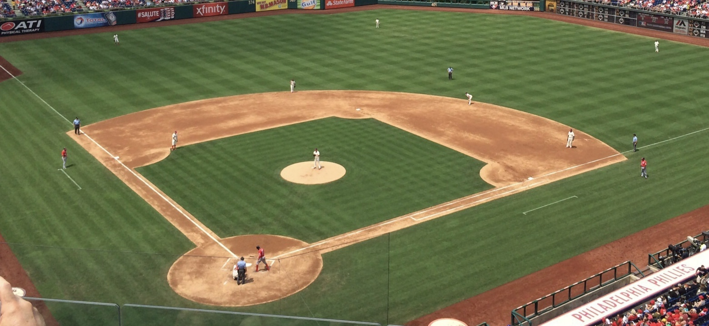

# 빠몽이 운영자 설명서 (사용 + 기술)

기준일: 2026-08-31  
대상: `/manager` 운영자 웹 · Android WebView

이 문서는 관리자 화면 `/admin/ops/system-manuals` 2장과 같은 소스입니다.

## 사용 설명서

하이브리드만 사용합니다. 실황이 타석을 돌리고, 운영자 버튼이 먼저면 그게 우선입니다. 토글은 없습니다.

### 1. 입장

카톡 로그인 링크 또는 아이디+당일 비밀번호. 배정된 제N경기만 다룹니다. 경기 시작 5분 전 이전에는 예측·진행 버튼이 비활성입니다. 처음부터 있는 것이 원칙입니다. 중간 입장도 되며, 지나간 타석은 다시 안 돌리고 화면에 켜진 다음 버튼만 누릅니다.

### 2. 화면

왼쪽은 타순·아웃, 가운데는 다음 할 일(「지금」), 오른쪽은 예측 시작/중지/결과/다음타자/공수/투수교체입니다. 점수는 실황 보드가 우선입니다. 점수를 고치면 수동 모드가 됩니다.

### 3. 정상(하이브리드)

실황이 타자를 안정화하면 예측이 열리고, 약 8초 후 자동 중지될 수 있습니다. TV와 맞으면 결과는 실황 제안 + 1탭 확정입니다. 버튼을 먼저 누르면 그 입력이 우선입니다. 토글은 없습니다.

### 4. 예외 루프

가드에 걸리면 예측 시작 → 중지 → 결과(아웃/1루/2루/3루/홈런) → 다음 타자. 결과 전에는 다음타자·공수·광고·투수교체가 막힙니다.

### 5. 3아웃·공수교대

3아웃 카운트는 운영자 결과(outsInHalf)입니다. 병살·삼살은 실황이 2아웃이어도 예측을 끝냅니다. 「3아웃 — 공수교대」음성·펄스는 네이버가 같은 초/말에서 3아웃일 때만 냅니다. 운영자만 3이고 실황이 1·2면 보류 배너만 보여 주고, 중계가 3아웃이면 공수교대합니다. 실황 3아웃을 운영자 누적에 쓰지 않습니다. 실황이 이미 다음 초/말(원아웃 등)이면 공수교대로 운영자 초/말을 실황에 맞추고 광고합니다. 폴링이 초/말·아웃을 덮지 않습니다. 실황 아웃이 없으면 가짜 0으로 막지 않습니다. 같은 초/말에서 실황이 늦으면 공수교대를 두 번 눌러 강제합니다.

### 6. 투수교체

같은 타석·대타를 유지합니다. 진행 중 예측은 환불되고 결과는 생략될 수 있습니다(skippedResult). 광고가 시작됩니다.

### 7. 광고

안내 5초 후 리워드 80초. 「예측 시작」으로 끄면 보상 없음. 운영자 「광고 중지」 또는 80초 워치독 종료면 회원 500P. 다음 타석 예측은 운영자가 「예측 시작」을 눌러야 열립니다.

### 8. 경기 종료

약 10초 「경기종료」 후 로그아웃입니다. 세션 만료 팝업이 아닙니다.

### 9. 중간 합류 · 재연결

중간 입장은 현재 타석부터입니다. 화면에 켜진 다음 버튼만 누릅니다. 공수교대가 켜져 있으면 한 번만 누르고, 이미 눌렀는지 모르면 실황 초/말·아웃을 본 뒤 맞을 때만 누릅니다. 네트워크가 끊기면 재로그인하지 말고 같은 화면에서 재연결합니다. 「실시간 연결 재시도 중」이어도 예측 시작·중지는 됩니다. 같은 기기 재로그인은 허용, 다른 기기는 거부입니다. 다른 폰으로 바꾸려면 예전 기기에서 먼저 로그아웃합니다.

### 예외 루프 한 줄

- 경기전(scheduled, 시작 5분 전 이전)에는 예측·진행 버튼이 비활성입니다.
- 정상: 실황이 열고 닫고 결과를 확정합니다. TV를 보며 필요할 때만 누릅니다.
- 가드에 걸리면: 예측시작 → 중지 → 결과 전송 → 다음 타자(3아웃이면 공수교대).
- 투수교체: 같은 타석 유지(대타 유지). 진행 중 예측은 환불·결과 생략 가능. 광고 시작.
- 공수교대: 운영자 3아웃 후, 네이버 같은 초/말 3아웃(또는 초/말 변경)이면 연다. 급하면 공수교대 두 번. 광고 시작. 예측 시작으로 광고를 끄면 보상 없음.
- 우천 중단: 실황이 SUSPEND/DELAY(또는 네이버 우천 중단)이면 예측이 자동 중지됩니다. 재개 후 「예측 시작」만. 우천 취소는 경기 취소입니다.
- 경기 종료: 약 10초 「경기종료」 후 로그아웃입니다. 「세션 만료」가 아닙니다.
- 중간 합류: 현재 타석부터. 화면에 켜진 다음 버튼만. 공수교대가 켜져 있으면 한 번만.
- 네트워크 끊김: 같은 화면에서 재연결. 재로그인보다 재연결이 우선. 다른 기기 로그인은 거부.

### 규칙

- 결과 확정 전 다음타자·공수교대·투수교체·광고 금지.
- 자동 확정 힌트: 아웃수↑ → 아웃, 1~3루 진루, 홈런(아웃 유지+타자 교체), 희생/병살→아웃, 야수선택→1루.
- 실황 타자 ≠ 선발 → 대타 표시. 투수교체는 대타 유지, 다음타자·공수는 대타 해제.
- 예측 시작 시 광고 자동 중지(ad_stopped.reason=prediction_start, 보상 없음).
- 스코어 PATCH → controlMode=manual. 「수동」을 끄면 다음 점수를 다시 받습니다.
- 공수교대는 liveScoreboard 이닝을 덮어쓰지 않습니다.
- 공수교대 타이밍: 네이버 같은 초/말 3아웃, 또는 실황이 이미 다음 초/말이면 맞춤+광고. 급하면 같은 초/말에서 공수교대 두 번.
- 중간 합류: 지나간 타석은 메우지 않는다. 화면에 켜진 다음 버튼만 누른다.
- 네트워크 끊김: 재로그인하지 말고 재연결. 같은 기기 재로그인만 허용, 다른 기기는 거부.

### 타석 상태머신

- **대기** — idle — 다음 타자 대기. 회원 화면은 시네마틱 빠몽이.
- **예측열림** — prediction_open — 회원 선택(3D 구장). 약 8초 후 자동 중지 가능.
- **예측닫힘** — prediction_closed — 결과 대기. 회원은 시네마틱 투수·내 예측 배지.
- **결과확정** — result_confirmed — 큰 글씨 후 적중 시 주루. 다음타자/공수교대.

- 결과 확정 전에는 다음타자·공수교대·광고·투수교체를 막습니다.
- 자동 확정: 아웃(아웃수↑)·1~3루·홈런(아웃 유지+타자 교체). 희생/병살→아웃, 야수선택→1루.
- 애매하면 제안만 하고 운영자가 「지금」 1탭으로 확정합니다.
- 실황 타자 ≠ 선발이면 대타 표시·자동 pinch. 투수교체는 대타를 유지합니다.
- 예측 시작 시 광고는 자동 중지됩니다(ad_stopped.reason=prediction_start, 보상 없음).
- 예전 liveAutoEnabled=false 잔여값은 폴링 시 true로 복구됩니다. 운영자 UI에 실황 자동 토글은 없습니다.

## 회원 화면이 따라가는 장면

운영자가 예측을 열면 3D 구장, 닫으면 투수 시네마틱, 적중하면 주루 실사입니다.

## 광고

| 상황 | 동작 | 보상 |
| --- | --- | --- |
| 투수교체·공수교대 | 안내 5초 후 리워드 동영상 시작 | 운영자 중지까지 보면 500P |
| 예측 시작 | 광고 중지 (ad_stopped: prediction_start) | 없음 |
| 운영자 광고 중지 | ad_stopped: operator_stop | 500P |
| 라운드 진행만 | ad_stopped: round_advance — 광고만 닫기 | 없음 |
| 웹 × (5초 후) | 같은 광고 세션은 재표시 안 함 | 없음 |
| 80초 경과 | 워치독이 광고 세션을 종료(reason=operator_stop). 예측 창은 운영자 「예측 시작」 | 500P |
| 예측 게임 하단 배너 | 사용하지 않음 | — |

## 기술 설명서

| 항목 | 내용 |
| --- | --- |
| 앱 | 운영자 웹 /manager, 필요 시 Android WebView |
| 인증 | AdminUser + 당일 비밀번호(dailyPasswordPlain) / loginLinkToken |
| 실황 폴링 | 기본 2초(최소 1.5초). 다음=점수, 네이버=주자·카운트 |
| 타자 안정화 | 타자명 약 2초, 투수명 기본 6초(최소 3초) |
| 예측 창 | 열린 뒤 8초 자동 중지(schedulePredictionAutoStop 한 루틴) |
| 타석 단계 | idle → prediction_open → prediction_closed → result_confirmed |
| WS | /ws/match — at_bat_phase, prediction_started/stopped, round_result, round_next, ad_started/stopped, match_ended |
| 권위 | 회원 화면 uiStage는 서버 at_bat_phase. 3아웃 카운트는 outsInHalf. 공수교대 음성은 네이버 같은 초/말 3아웃. 실황이 다음 초/말이면 공수교대=맞춤+광고(폴링이 초/말을 덮지 않음) |
| API 예 | 예측 시작/중지, 결과 전송, 다음타자, 공수교대, 투수교체, PATCH scoreboard |

### 실황 소스

| 항목 | 소스 | 비고 |
| --- | --- | --- |
| 일정 자동 등록·팀 로고 | 다음 스포츠 | 관리자 경기 관리 원형 로고 |
| 득점·안타·실책·볼넷·이닝표 | 다음 스포츠 | liveScoreboard. controlMode=auto일 때 덮어씀 |
| 주자·볼-스트라이크·아웃 | 네이버 문자중계 | 수동 점수여도 주자는 네이버 갱신 |
| 타자·구종 | 네이버 문자중계 | 타석이 없으면 0-0 0 OUT을 가짜로 채우지 않음 |
| 상대전적 | 네이버 preview | 스코어보드 바로 아래 |
| 선발명단 타순 | 네이버 (경기는 다음으로 찾음) | API-SPORTS 라인업 폴백 없음 |
| matchStatus=ongoing | 다음 스포츠만 | 시작 전(BEFORE/READY)이면 scheduled로 되돌림 |

- 「예측 시작」은 predictionEnabled / sideBetsLocked만 켭니다. matchStatus를 ongoing으로 올리지 않습니다.
- matchStatus=ongoing은 다음 스포츠 실황 근거로만 올립니다. 시작 전이면 scheduled로 되돌립니다.
- 다음·네이버가 우천 중단(재개 가능)이면 예측을 즉시 중지·환불하고 matchStatus는 종료하지 않습니다. 우천 취소는 cancelled.
- 관리자·운영자 스코어 PATCH는 controlMode=manual. 「수동」을 끄면 auto로 돌아가 다음 점수를 다시 받습니다.
- 운영자 공수교대는 liveScoreboard 이닝을 덮어쓰지 않습니다. 화면의 N회 초/말·점수는 실황 보드를 우선합니다.

### API · WS 메모

- 예측 시작/중지, 결과 전송, 다음타자, 공수교대, 투수교체, PATCH `/api/manager/matches/:id/scoreboard`
- WS `/ws/match`: `at_bat_phase`, `prediction_started` / `stopped`, `round_result`, `round_next`, `ad_started` / `ad_stopped`, `match_ended`
- 회원 `uiStage` 권위는 서버 `at_bat_phase`
- 3아웃 카운트는 `Match.outsInHalf`. 「3아웃 공수교대」음성은 네이버 같은 초/말 3아웃만. 실황 1·2면 보류 배너. 실황이 이미 다음 초/말이면 공수교대=맞춤+광고. 폴링이 운영자 초/말·아웃을 덮지 않음
- 실황 ON은 `AdminUser.apiSyncEnabled` (Match 필드가 아님)
